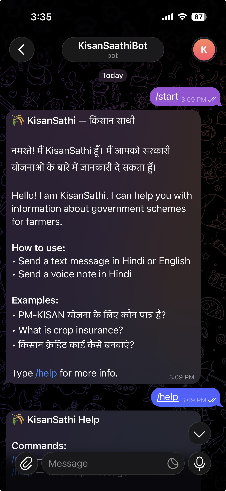
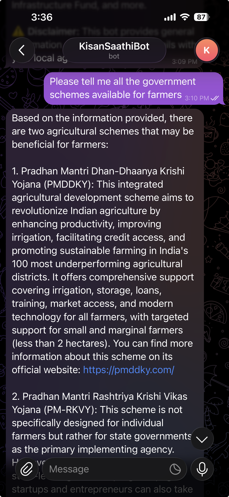
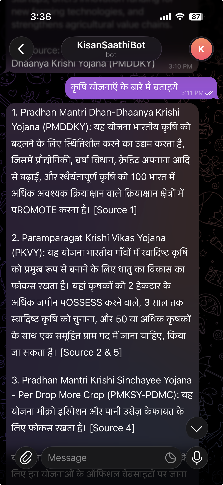
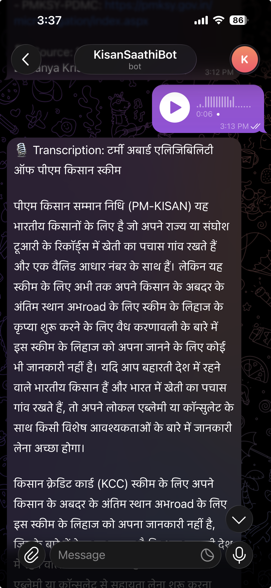

# KisanSathi — AI-Powered Farmer Scheme Advisory

An AI-powered Telegram bot that helps Indian farmers discover and understand government schemes through text and voice queries in Hindi and English. Built using RAG (Retrieval-Augmented Generation) with local LLMs — no API keys needed, fully private.

> **Ask a question, get a grounded answer.** No hallucination — every answer is sourced from official scheme documents.

## Features

- **Multilingual** — Supports Hindi and English text queries with auto language detection
- **Voice Input** — Send Hindi voice notes on Telegram, get scheme answers back
- **16 Government Schemes** — PM-KISAN, PMFBY, KCC, PM-KUSUM, Soil Health Card, eNAM, and more
- **Grounding Verification** — Every answer is checked against source documents to prevent hallucination
- **Fully Local** — Runs on your machine with Ollama + Mistral 7B. No cloud APIs, no data leaves your device
- **Source Citations** — Every answer includes the scheme name it was sourced from

## Demo

|                         /start & /help                          |                           English Query                           |                              Hindi Query                               |                            Voice Query                            |
| :-------------------------------------------------------------: | :---------------------------------------------------------------: | :--------------------------------------------------------------------: | :---------------------------------------------------------------: |
|                          |                              |                                       |                                  |
| Bot welcome message with usage instructions and example queries | English text query returning scheme details with source citations | Hindi text query with auto-translation and Hindi response with sources | Hindi voice note transcription followed by scheme answer in Hindi |

## Architecture

```
┌─────────────────────────────────────────────────────────────────────┐
│                        Telegram Bot                                 │
│                   (Text + Voice Input)                               │
└──────────┬──────────────────────────────────┬───────────────────────┘
           │ Text                              │ Voice (.ogg)
           ▼                                   ▼
┌──────────────────┐                ┌─────────────────────┐
│   Translator     │                │   Voice Transcriber  │
│ (Hindi ↔ English │                │ (Whisper-Hindi)      │
│  via Mistral)    │                │  .ogg → .wav → text  │
└────────┬─────────┘                └──────────┬──────────┘
         │ English query                       │ Hindi text
         ▼                                     │
┌──────────────────┐                           │
│   Retriever      │◄──────────────────────────┘
│ (MiniLM embed +  │
│  ChromaDB search)│
└────────┬─────────┘
         │ Top-5 chunks
         ▼
┌──────────────────┐
│   Generator      │
│ (Mistral 7B via  │
│  Ollama)         │
└────────┬─────────┘
         │ English answer
         ▼
┌──────────────────┐     ┌──────────────────┐
│   Verifier       │────▶│   Translator     │
│ (Token overlap   │     │ (English → Hindi │
│  grounding check)│     │  response)       │
└──────────────────┘     └────────┬─────────┘
                                  │
                                  ▼
                          Hindi/English Answer
                          + Source Citations
                          + Grounding Score
```

### How It Works

1. **Ingestion** — 16 government scheme documents are chunked by section, prefixed with scheme context, embedded using multilingual MiniLM, and stored in ChromaDB
2. **Translation** — Hindi queries are translated to English for optimal retrieval; answers are translated back to Hindi
3. **Retrieval** — Query is embedded and top-5 most similar chunks are retrieved via cosine similarity
4. **Generation** — Retrieved chunks are injected into a grounded prompt, and Mistral 7B generates an answer constrained to only use provided context
5. **Verification** — Token overlap scoring checks if the answer is grounded in source chunks (score 0.0–1.0)
6. **Voice** — Telegram voice notes (.ogg) are converted to WAV via ffmpeg and transcribed using Whisper fine-tuned for Hindi

## Project Structure

```
kisansathi/
├── src/
│   ├── __init__.py
│   ├── bot.py             # Telegram bot (text + voice handlers)
│   ├── pipeline.py        # Unified RAG pipeline (text_query + voice_query)
│   ├── retriever.py       # Semantic search against ChromaDB
│   ├── generator.py       # Grounded generation via Ollama/Mistral
│   ├── translator.py      # Hindi ↔ English translation via Mistral
│   ├── verifier.py        # Answer grounding verification
│   └── voice.py           # Voice-to-text (Whisper-Hindi + ffmpeg)
├── scripts/
│   ├── ingest.py          # Document ingestion pipeline
│   └── query.py           # CLI query interface
├── data/
│   └── farmers-scheme/    # 16 government scheme documents (.md)
├── chroma_db/             # ChromaDB persistent vector store (generated)
├── future-extensions/     # PRD, execution plan, full roadmap
├── .env.example           # Environment variable template
└── requirements.txt
```

## Setup

### Prerequisites

- Python 3.9+
- [Ollama](https://ollama.com/) installed locally
- [ffmpeg](https://ffmpeg.org/) (for voice input support)
- Telegram account (for bot usage)

### Installation

```bash
# Clone the repo
git clone https://github.com/paras0419-sa/farmers-scheme-advisory.git
cd farmers-scheme-advisory

# Create virtual environment
python -m venv venv
source venv/bin/activate

# Install dependencies
pip install -r requirements.txt

# Pull Mistral 7B model (~4.4 GB)
ollama pull mistral

# Install ffmpeg (macOS)
brew install ffmpeg
```

### Environment Setup

```bash
# Copy the example env file
cp .env.example .env

# Add your Telegram bot token (get from @BotFather on Telegram)
# Edit .env and set: TELEGRAM_BOT_TOKEN=your_token_here
```

### Running

#### 1. Ingest Scheme Documents

```bash
python scripts/ingest.py
```

This parses all 16 scheme documents, chunks them by section, generates embeddings, and stores them in ChromaDB.

#### 2. Query via CLI (for testing)

```bash
# Single query
python scripts/query.py "What is PM-KISAN and who is eligible?"

# Interactive mode
python scripts/query.py --interactive

# Debug retrieval quality
python scripts/query.py "query here" --show-chunks

# Adjust number of retrieved chunks
python scripts/query.py "query here" --top-k 3
```

#### 3. Query via Pipeline (Hindi + English)

```bash
# Hindi query
python -m src.pipeline "PM-KISAN योजना के लिए कौन पात्र है?"

# English query
python -m src.pipeline "What schemes provide crop insurance?"

# Voice file
python -m src.pipeline voice_note.ogg
```

#### 4. Start Telegram Bot

```bash
python -m src.bot
```

Then open Telegram, find your bot, and start chatting.

## Sample Test Queries

### English

| Query                                             | Expected Source | Grounding |
| ------------------------------------------------- | --------------- | --------- |
| What is PM-KISAN and who is eligible?             | PM-KISAN        | 0.88      |
| How can a farmer get crop insurance?              | PMFBY           | 0.75      |
| What is the interest rate on Kisan Credit Card?   | KCC             | 0.94      |
| What schemes are available for solar energy?      | PM-KUSUM        | 0.72      |
| Tell me about Soil Health Card scheme             | SHC             | 0.77      |
| How to apply for Agriculture Infrastructure Fund? | AIF             | 0.74      |
| What is eNAM and how does it help farmers?        | eNAM            | 0.82      |
| What schemes support organic farming?             | PKVY            | 0.71      |
| How to cook biryani? _(ungrounded test)_          | —               | 0.08      |

### Hindi

| Query                                        | Translation                              | Grounding |
| -------------------------------------------- | ---------------------------------------- | --------- |
| PM-KISAN योजना के लिए कौन पात्र है?          | Who is eligible for PM-KISAN?            | 0.62      |
| फसल बीमा कैसे मिलेगा?                        | How to get crop insurance?               | 0.72      |
| किसान क्रेडिट कार्ड पर ब्याज दर क्या है?     | What is the interest rate on KCC?        | 0.66      |
| खेती में सोलर एनर्जी के लिए कौन सी योजना है? | What scheme for solar energy in farming? | 0.67      |
| जैविक खेती के लिए कौन सी सरकारी योजना है?    | Which govt scheme for organic farming?   | 0.80      |
| छोटे किसानों के लिए कौन सी योजनाएं हैं?      | What schemes for small farmers?          | 0.83      |
| बिरयानी कैसे बनाएं? _(ungrounded test)_      | How to make biryani?                     | 0.04      |

> Grounding score: 0.0–1.0 (higher = more grounded in source documents). Ungrounded queries correctly score near 0.

## Scheme Coverage

16 Indian government schemes for farmers:

| #   | Scheme                           | Category                        |
| --- | -------------------------------- | ------------------------------- |
| 1   | PM-KISAN Samman Nidhi            | Direct income support           |
| 2   | PMFBY (Fasal Bima Yojana)        | Crop insurance                  |
| 3   | Kisan Credit Card (KCC)          | Agricultural credit             |
| 4   | PM-KUSUM                         | Solar energy for farmers        |
| 5   | Soil Health Card                 | Soil testing & advisory         |
| 6   | eNAM                             | Online agricultural market      |
| 7   | Agriculture Infrastructure Fund  | Infrastructure loans            |
| 8   | PM Dhan-Dhaanya Krishi Yojana    | Agricultural development        |
| 9   | Paramparagat Krishi Vikas Yojana | Organic farming                 |
| 10  | PM Krishi Sinchayee Yojana       | Irrigation (Per Drop More Crop) |
| 11  | RKVY                             | State agricultural development  |
| 12  | National Food Security Mission   | Food grain production           |
| 13  | SMAM                             | Agricultural mechanization      |
| 14  | NMEO Oil Palm                    | Oil palm cultivation            |
| 15  | MISS                             | Interest subvention on loans    |
| 16  | Mission Aatmanirbharta           | Pulses self-sufficiency         |

## Tech Stack

| Component     | Technology                              | Why                                                        |
| ------------- | --------------------------------------- | ---------------------------------------------------------- |
| Embeddings    | `paraphrase-multilingual-MiniLM-L12-v2` | Multilingual support for Hindi + English queries           |
| Vector Store  | ChromaDB (persistent, cosine distance)  | Simple, embedded, no server needed                         |
| LLM           | Mistral 7B via Ollama                   | Free, local, no API key, good quality for grounded Q&A     |
| Translation   | Mistral 7B via Ollama                   | Reuses existing model, no extra download                   |
| Voice (ASR)   | `vasista22/whisper-hindi-small`         | Whisper fine-tuned for Hindi, runs on CPU/MPS              |
| Audio         | ffmpeg                                  | Converts Telegram .ogg voice notes to WAV for Whisper      |
| Bot Framework | python-telegram-bot                     | Async, well-maintained, official Telegram Bot API wrapper  |
| Verification  | Token overlap scoring                   | Simple, no ML model needed, catches obvious hallucinations |
| Language      | Python 3.9                              | Ecosystem support for ML/NLP libraries                     |

## Design Decisions

### Cosine Distance Instead of L2

ChromaDB defaults to L2 (Euclidean) distance. We switched to cosine because text embeddings from sentence-transformers are normalized for cosine similarity. L2 produced scores of 16–18 (hard to interpret); cosine gives clean 0–1 similarity scores.

### Scheme-Name Prefix on Every Chunk

Each chunk is prepended with scheme name + section heading (e.g., `PM Kisan Samman Nidhi (PM-KISAN) — Eligibility Criteria:`). Without this, the query "What is the eligibility for PM-KISAN?" returned "How to Apply" instead of "Eligibility Criteria" because the eligibility chunk was too short for the embedding model to score correctly.

### Section-Based Chunking

Documents are split by `##` markdown headings rather than arbitrary character boundaries. This preserves semantic coherence — each chunk represents one complete topic (Benefits, Eligibility, How to Apply). Large sections fall back to overlapping character-based chunking.

### LLM-Based Translation Over Dedicated Models

We use Mistral for Hindi ↔ English translation instead of a dedicated translation model. This avoids downloading an extra model (~1GB+) and Mistral handles Hindi well enough for understanding farmer queries. Trade-off: translation quality won't match Google Translate, but it's sufficient for MVP.

### Lazy Model Loading

The Whisper-Hindi model (~500MB) is loaded only when a voice message is received, not at startup. This keeps the bot responsive for text-only users.

## Telegram Bot Commands

| Command  | Description                              |
| -------- | ---------------------------------------- |
| `/start` | Welcome message with usage instructions  |
| `/help`  | List of features, covered schemes, usage |

Send any text message in Hindi or English to get scheme information.
Send a Hindi voice note to get a transcription + scheme answer.

## License

See [LICENSE](LICENSE) file.
